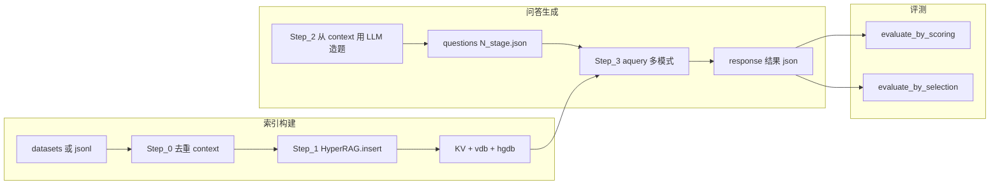

# Hyper-RAG 项目分析与复现计划

## 架构摘要（将写入 [arch.md](d:/Work/Papers/RAG/hyper-rag/Hyper-RAG/arch.md) 的正文骨架）

### 目录与职责（不涉及 `web-ui/`、`datasets/` 细节）

| 路径 | 作用 |
|------|------|
| [hyperrag/](d:/Work/Papers/RAG/hyper-rag/Hyper-RAG/hyperrag/) | 核心库：`HyperRAG` 类、入库、多模式查询、存储抽象 |
| [reproduce/](d:/Work/Papers/RAG/hyper-rag/Hyper-RAG/reproduce/) | 论文级流水线脚本 Step_0～3 |
| [evaluate/](d:/Work/Papers/RAG/hyper-rag/Hyper-RAG/evaluate/) | 打分评测与对比评测 |
| [examples/](d:/Work/Papers/RAG/hyper-rag/Hyper-RAG/examples/) | 小型演示（`mock_data.txt`） |
| [service_api.py](d:/Work/Papers/RAG/hyper-rag/Hyper-RAG/service_api.py) | FastAPI 服务，对接已构建的 `caches/<data_name>` |
| [config_temp.py](d:/Work/Papers/RAG/hyper-rag/Hyper-RAG/config_temp.py) | 复制为 `my_config.py` 的模板（LLM + Embedding） |

### 核心类与存储

- **`HyperRAG`**（[hyperrag/hyperrag.py](d:/Work/Papers/RAG/hyper-rag/Hyper-RAG/hyperrag/hyperrag.py)）：工作目录 `working_dir` 下挂载：
  - **KV**：`full_docs`、`text_chunks`、`llm_response_cache`（JSON 文件，见 [hyperrag/storage.py](d:/Work/Papers/RAG/hyper-rag/Hyper-RAG/hyperrag/storage.py)）
  - **向量库**：`NanoVectorDB` 持久化为 `vdb_*.json`（**entities**、**relationships**、**chunks**）
  - **超图**：`HypergraphStorage`（`hypergraph-db` 的 `HypergraphDB`），文件如 `hypergraph_chunk_entity_relation.hgdb`
- **查询模式** `QueryParam.mode`（同文件 `aquery` 分支）：`hyper` | `hyper-lite` | `graph` | `naive` | `llm`；检索与提示组装逻辑在 [hyperrag/operate.py](d:/Work/Papers/RAG/hyper-rag/Hyper-RAG/hyperrag/operate.py)（体量较大，负责分块、实体/关系抽取、各类 query 实现）。

### 端到端链路（论文复现主路径）

- **Step_0**（[reproduce/Step_0.py](d:/Work/Papers/RAG/hyper-rag/Hyper-RAG/reproduce/Step_0.py)）：从 `datasets/<data_name>/*.jsonl` 提取唯一 `context`，写入 `caches/<data_name>/contexts/<stem>_unique_contexts.json`。
- **Step_1**（[reproduce/Step_1.py](d:/Work/Papers/RAG/hyper-rag/Hyper-RAG/reproduce/Step_1.py)）：读入上述 JSON，调用 `rag.insert(...)` 触发分块、向量化、实体关系抽取、超图更新；**依赖根目录 `my_config.py`**。
- **Step_2**（[reproduce/Step_2_extract_question.py](d:/Work/Papers/RAG/hyper-rag/Hyper-RAG/reproduce/Step_2_extract_question.py)）：脚本内可设 `question_stage` 1/2/3（单段/两段/三段复合题），用 **同步 OpenAI 客户端** + 较强模型（注释建议 `gpt-4o`）生成问题列表至 `caches/<data_name>/questions/`。
- **Step_3**（[reproduce/Step_3_response_question.py](d:/Work/Papers/RAG/hyper-rag/Hyper-RAG/reproduce/Step_3_response_question.py)）：对问题列表跑 `aquery`，`mode` 控制 **naive / hyper / hyper-lite** 等，输出到 `caches/<data_name>/response/`。
- **评测**：  
  - [evaluate/evaluate_by_scoring.py](d:/Work/Papers/RAG/hyper-rag/Hyper-RAG/evaluate/evaluate_by_scoring.py)：需要 **问题文件** 与同名 **`_ref`** 参考（来自数据管道）、以及 Step_3 的 **answer json**；用 LLM 对五维指标打分。  
  - [evaluate/evaluate_by_selection.py](d:/Work/Papers/RAG/hyper-rag/Hyper-RAG/evaluate/evaluate_by_selection.py)：两模型答案逐条对比（需准备两份 response）。

### 与 README 不一致处（写入 arch.md 时如实记录）

- README 写 `cache/{{data_name}}`，脚本统一使用 **`caches/`**（复现时以代码为准）。
- [requirements.txt](d:/Work/Papers/RAG/hyper-rag/Hyper-RAG/requirements.txt) **未列出** `tqdm`、`fastapi`、`uvicorn` 等，但 **Step_2/3、evaluate、service_api** 会用到；复现需补全依赖（见下）。

### 实施说明（你确认本计划后）

在仓库根目录 **新建 [arch.md](d:/Work/Papers/RAG/hyper-rag/Hyper-RAG/arch.md)**，包含：模块说明、数据流、缓存目录结构、`QueryParam` 模式表、与 README 的差异、可选附「外部依赖图」（Hypergraph-DB、nano-vectordb、OpenAI API）。

---

## 依赖、软件与资源清单

### Python / 包

- **已声明**：[requirements.txt](d:/Work/Papers/RAG/hyper-rag/Hyper-RAG/requirements.txt)（含 `hypergraph-db`、`nano-vectordb`、`openai` 等）。
- **实践中需补充**（按实际用到的脚本）：`tqdm`；若跑 API：`fastapi`、`uvicorn`；通常还需单独安装 **与 embedding 模型维度一致** 的可调用服务客户端（见 vLLM 节）。

### 模型与 API（你的偏好：vLLM 为主，官方/兼容为辅）

| 角色 | 论文/README 参考 | vLLM 路径要点 |
|------|------------------|---------------|
| 抽取实体/关系、摘要、答题 | `my_config` 中 `LLM_*` | vLLM 提供 **OpenAI Chat Completions 兼容** `base_url`；模型名与部署一致 |
| 向量嵌入 | `EMB_MODEL` + `EMB_DIM` | **关键**：`EmbeddingFunc(embedding_dim=EMB_DIM)` 必须与 **实际 embedding 输出维度** 一致；若换模型必须同步改 `EMB_DIM`，否则向量库会错乱 |
| Step_2 出题 | 脚本内硬编码可用 `gpt-4o` | 可改为同一 vLLM 上的强模型名，或保留单独 OpenAI 调用 |

**建议架构**：vLLM 跑 chat 模型；embedding 若 vLLM 不支持或维度不同，可 **embedding 仍走官方/兼容 API**，仅 chat 走 vLLM——在 `my_config` 分两套 URL/KEY 即可（代码已分离 `LLM_*` 与 `EMB_*`）。

### API 速率限制（规划假设：聊天模型 RPM = 1000）

- **约定**：当前计划按所用 **聊天（chat/completions）模型** 的 **RPM = 1000**（每分钟最多约 1000 次请求）书写调参与风险提示；若实际套餐或自建网关不同，以控制台文档为准并相应调整并发。
- **影响**：`HyperRAG` 在实体/关系抽取、多模式查询及 reproduce 脚本中会 **高并发** 调用 LLM；若瞬时请求数折合 **持续超过 ~1000/分钟**，易出现 **429 Too Many Requests**。应在 `HyperRAG(..., llm_model_max_async=...)`、Step 脚本的并行度或批处理节奏上 **为 RPM 留余量**（并计入评测、出题等其它同 base 的调用）。
- **与 embedding**：`/v1/embeddings` 是否 **单独计数**、是否共享账户级配额，以服务商说明为准；即使 RPM 宽裕，仍可能因 burst 出现 **403** 等非 429 限制，需配合 **`embedding_batch_num` / `embedding_func_max_async`** 等降低突发（参见 [examples/hyperrag_demo.py](examples/hyperrag_demo.py) 中的注释与可选环境变量）。

### 数据集（不展开扫目录）

- 官方下载：README 中 Google Drive / 百度网盘；放置方式需与 **Step_0 默认 `datasets/<data_name>`** 及脚本中的 **`data_name`** 一致（当前脚本默认 `data_name = "mix"`，复现 NeurologyCrop 时应改为一致的数据目录名并贯穿 Step_0～3 与 evaluate）。

---

## 复现路线：从单任务到全局

### 阶段 A — 最小可验证（单任务级）

1. **环境**：Python 3.10+（建议），`pip install -r requirements.txt`，并手动补上 `tqdm` 及（若需要）`fastapi`、`uvicorn`。
2. **配置**：复制 `config_temp.py` → `my_config.py`；按 vLLM/OpenAI 填写 `LLM_*`、`EMB_*`，**核对 `EMB_DIM`**。
3. **跑通示例**：[examples/hyperrag_demo.py](d:/Work/Papers/RAG/hyper-rag/Hyper-RAG/examples/hyperrag_demo.py)（`caches/mock` + `examples/mock_data.txt`），验证 **insert + naive/hyper/hyper-lite** 三种查询无报错。若聊天模型 **RPM=1000** 仍遇 429，优先压低 **`llm_model_max_async`**、缩短单次插入文本（如示例脚本支持的环境变量截断），再考虑错峰重跑。

**成功判据**：控制台打印三种模式均有返回；`caches/mock` 下生成 kv/vdb/hgdb 等文件。

### 阶段 B — NeurologyCrop（或单一大域）主链路（你当前目标）

1. 将官方 Neurology 数据按 Step_0 期望放入 `datasets/<name>/`（jsonl，`context` 字段）。
2. 统一修改（或命令行传入）各 Step 中 **`data_name`** 与输出目录 **`caches/<data_name>`**。
3. 顺序执行：**Step_0 → Step_1**（索引构建，耗时与 API 调用量最大）。
4. **Step_2**：生成 `1_stage.json` / `2_stage.json` / `3_stage.json`（按需）；注意出题 LLM 的费用与速率。
5. **Step_3**：对同一 `working_dir` 分别跑 **`hyper`**、**`hyper-lite`**、**`naive`**（及论文若对比 graph 则 **`graph`**），保存多份 `response/*.json`。

**成功判据**：`caches/<data_name>/response/` 下有多模式、多 stage 的结果文件，可与论文趋势定性对比（数值不必与论文一致，因你已允许 LLM 与设置不同）。

### 阶段 C — 评测

1. **Scoring**：确认 [evaluate/evaluate_by_scoring.py](d:/Work/Papers/RAG/hyper-rag/Hyper-RAG/evaluate/evaluate_by_scoring.py) 所需 **`questions/<n>_stage.json` 与 `<n>_stage_ref.json`** 已存在；与 Step_3 的 `mode`、`stage` 路径参数对齐后运行；结果写入 `caches/.../evalation/`（目录名为代码中的拼写）。
2. **Selection**：准备两组方法的 answer 文件，修改脚本中的路径后运行。

### 阶段 D — 全局扩展（可选）

- 多数据集：重复 B+C，仅换 `data_name` 与数据目录。
- **service_api** + `testHTML_light.html`：在已有 `caches/<data_name>` 上提供 HTTP 演示（需 `uvicorn`）；环境变量见 `service_api.py` 顶部 `HYPERRAG_*`。
- **Web-UI**：README 指向已删除的 `web-ui/README.md`（当前 git 状态为删除）；若需可视化，需从上游仓库恢复或单独处理——此项不作为论文数值复现的必要路径。

---

## 风险与注意事项

- **RPM 与并发（聊天模型按 1000 RPM 规划）**：Step_1 索引构建、Step_2/3 与 `extract_entities` 等会密集调用 **chat/completions**；默认较高的 `llm_model_max_async` 易在短时内 **逼近或超过 1000 RPM** 而 429。复现前应结合该上限调低异步并发或拉长流水线，必要时对 embedding 侧同样限流。
- **随机性与模型差异**：换 vLLM 模型后，实体抽取与答案分布会变，**不必强求与论文数值一致**，应固定 seed（若库支持）、固定 prompt 版本，并记录模型 ID。
- **缓存与重跑**：`llm_response_cache` 与向量库持久化后，改模型若不重建 `caches/<data_name>` 可能导致隐性不一致；大改配置建议 **清空该数据目录重建索引**。
- **`QueryParam` 默认值**： [hyperrag/base.py](d:/Work/Papers/RAG/hyper-rag/Hyper-RAG/hyperrag/base.py) 中 `mode` 默认字面为 `"hyper-query"`，与 [hyperrag/hyperrag.py](d:/Work/Papers/RAG/hyper-rag/Hyper-RAG/hyperrag/hyperrag.py) 的分支不一致；实际脚本均显式传入 `mode`，复现时 **始终以显式 `QueryParam(mode=...)` 为准**。

---

## 待你后续确认的执行动作（批准计划后由 Agent 执行）

1. 新建并填充 [arch.md](d:/Work/Papers/RAG/hyper-rag/Hyper-RAG/arch.md)（完整架构说明，中文）。
2. （可选）增补 `requirements.txt` 或 `requirements-dev.txt` 列出 `tqdm`、`fastapi`、`uvicorn`，避免复现环境遗漏。
